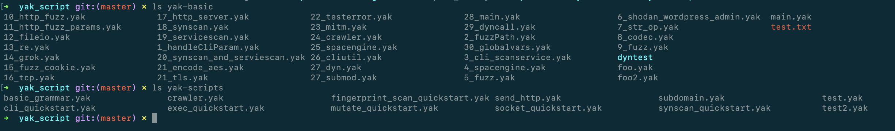

# yak_script

​	此项目是用来托管 yak语言编写的 poc 以及exp脚本

Yak 是一门安全测试专用语言。可以用它来快速编写扫描器，进行安全扫描，集成调用任何第三方工具与接口。

虽然还在内部开发，但是已内部实现大量编码、加密、http、tcp、udp、网络空间引擎(fofa、shodan、quake)、端口扫描、服务识别、并发控制、fuzz、爬虫等功能，可直接进行调用。

详细使用说明参考 网站 https://yaklang.github.io/yak-project-main-page/  


### demo

样例文件为 yak-basic 以及yak-scripts 




### 实际案例

S2_001

```
req, err = http.Post(
        url,
        http.useragent(http.uarand()),
        http.header("Content-Type","application/x-www-form-urlencoded"),
        http.body(sprintf("username=test&password=%s",check_poc)),
        )
    if err != nil {
        return
    }
    if re.Match(parseStr(num1+num2),http.GetAllBody(req)){
    	log.warn("S2_001 found !!!")
    }else{
        log.debug("S2_001 safe !!!")
    }

```


