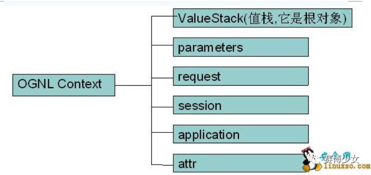
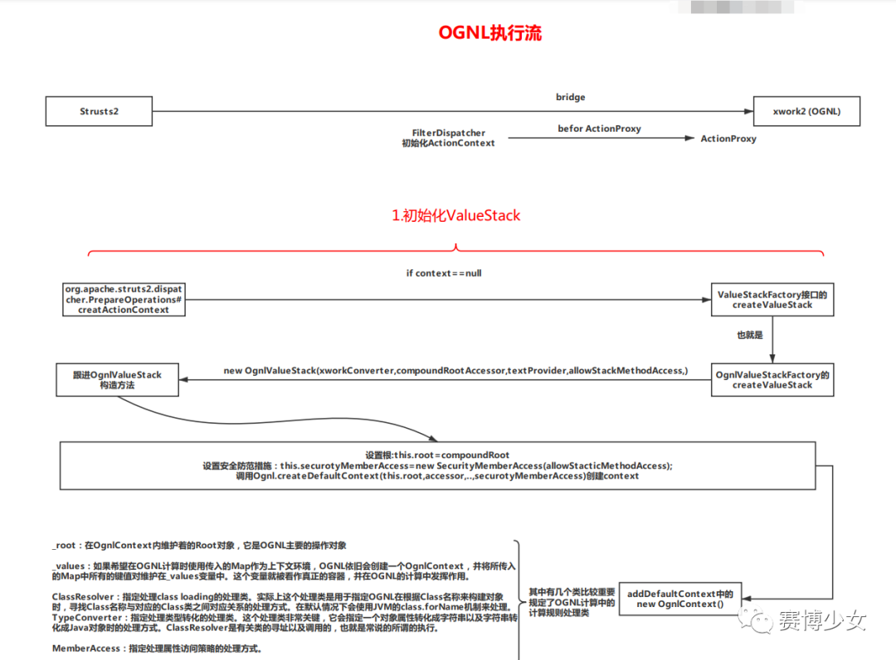
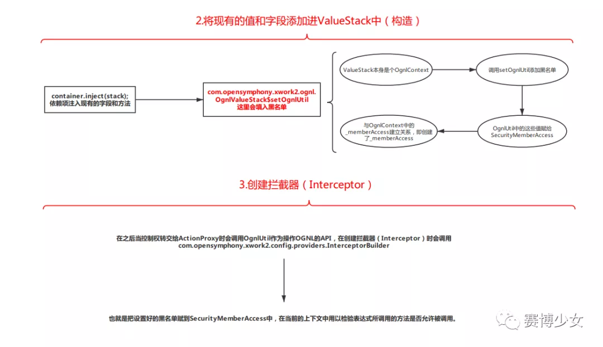
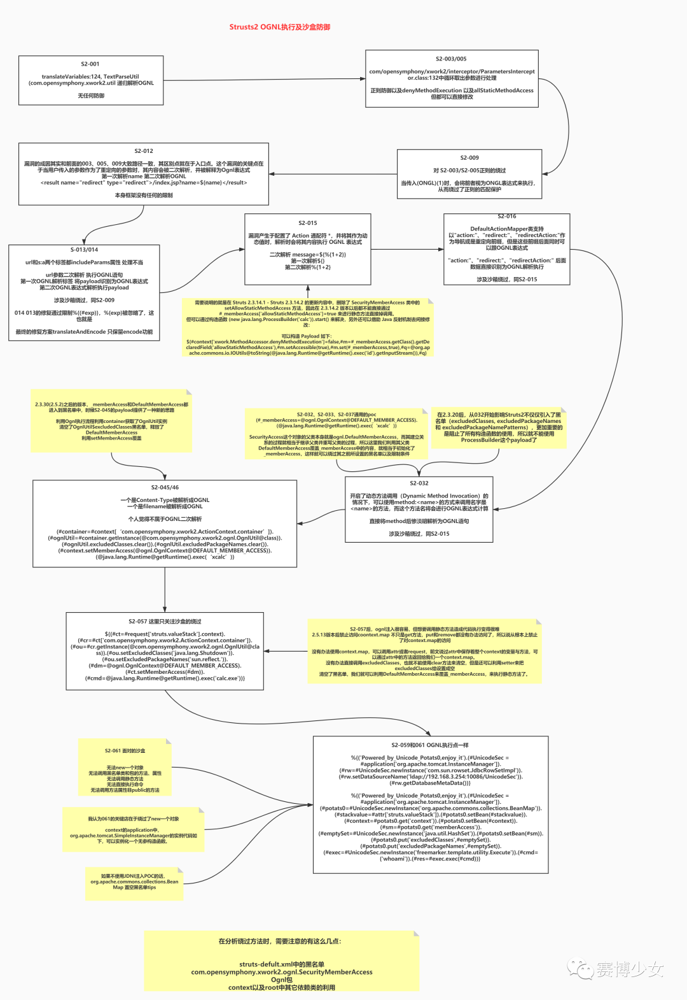

## Struts2 中的OGNL、表达式注入及防御

一、OGNL简介

我们知道JSP中使用EL为表达式语言，Spring中使用SPEL为表达式语言，而Strusts中使用OGNL为表达式语言。

OGNL(Object Graphic Navigation Language) 对象图导航语言，通过简单语句可以任意读取对象的属性或调用对象的方法，遍历整个对象的结构图，实现对象属性类型的转换等功能。Struts2的标签库都是使用OGNL表达式来访问ActionContext中的对象数据。如：

二、OGNL三要素

表达式、根对象、上下文环境

**1.experssion**

OGNL的核心，规定了表达式要做干什么

**2.root**

OGNL的操纵对象，可以理解为对谁干

**3.context**

表达式对根对象进行取值设置时，在OGNL的内部，所有操作都会在一个特定环境中运行，这个环境就是context，context是一个Map结构，被称为OnglContext，而跟对象root也会被加到上下文环境中。OGNL操作context中的对象时需要#符号。

三、Strusts2 中的OGNL实现

Strusts2中 OGNL context的实现者为ActionContext，root的实现者为valueStack，结构如下

Struts2将其他对象和valueStack一起放在ActionContext中

**1.ActionContext**

Strusts2中context的实现者，本质是一个MAP，里面存储了action，每个action活动时所操作的环境都在这个ActionContext中。Struts2将ActionContext设置为OGNL上下文，并将ValueStack作为OGNL的根对象放置到ActionContext中.

**2.ValueStack**

ValueStack被称为值栈对象，本身是一个ArrayList，充当OGNL的root。

Strusts2接收到一个请求时，也就是访问Action时，Strusts2会迅速创建ActionContext、ValueStack、action对象。Strusts2会将Action放入ValueStack中，将valueStack放入request域中，传入jsp页面，jsp就可以使用OGNL表达式获取值栈中的数据了。

它是一个接口，实际上使用时是使用实现了这个接口的类OgnlValueStack，ValueStack贯穿action的整个生命周期，每一个action实例都有一个Value对象，其中保存了当前的action对象和其它相关对象，它随着action的死亡而销毁。

ValueStack中的数据有两种：root(栈结构)、context(map结构OgnlContext)

root为CompoundRoot，struts2中，一个请求在最终到达Action的方法之前，Action对象本身会被压入ValueStack（实际上就是放到ValueStack的CompoundRoot中），所以action对象是CompoundRoot中的一个元素.。

context为OgnlContext。

这里可能就有点懵逼了，不是刚说ActionContext中包含ValueStack麽？其实ValueStack和ActionContext是相互包含的关系。

可以看到其实ActionContext和valueStack是“相互包含”的关系，当然准确点来说，valueStack是ActionContext中的一部分，而ActionContext所描述的也不只是一个OGNLcontext的代替品，毕竟它更多是为action构建一个独立的运行环境（新的线程）。而这样的关系就导致了我们可以通过valueStack访问ActionContext中的属性而反过来亦然。

其实可以用一种不是很标准的表达方式来描述这样的关系：可以把valueStack想成ActionContext的索引，你可以直接通过索引来找到表中的数据，也可以在表中找到所有数据的索引，无非是书与目录的关系罢了。

**
**

**1.1.application**

用于访问ServletContext，例如#application.userName或者#application['userName']，相当于调用ServletContext的getAttribute("username")。

**1.2.session**

用来访问HttpSession，例如#session.userName或者#session['userName']，相当于调用session.getAttribute("userName")。

**1.3.requests**

用来访问HttpServletRequest属性（attribute）的Map，例如#request.userName或者#request['userName']，相当于调用request.getAttribute("userName")。

**1.4.paragramer**

用于访问HTTP的请求参数，例如#parameters.userName或者#parameters['userName']，相当于调用request.getParameter("username")。

**1.5.attr**

attr中保存着request、session、application中的说有属性，如果有重复则以request中的为准。request > session > application > attr

**下面三、四 内容都是参考https://www.anquanke.com/post/id/169735 总结的**

三、OGNL执行流

四、 Struts2 OGNL表达式注入及防御概览

补上一个目前的黑名单长酱紫

五、参考链接

https://xiuxiu.web.meitu.com/main.html

https://www.cnblogs.com/potatsoSec/p/14111163.html

https://buaq.net/go-47936.html

https://developer.aliyun.com/article/330637

https://juejin.cn/post/6844904013683507207

https://blog.csdn.net/tjcyjd/article/details/6850203

https://www.cnblogs.com/huangting/p/11105051.html

[文章链接](https://mp.weixin.qq.com/s/8YxQPDu6sx-w_O4BrBCEmw)

喜欢此内容的人还喜欢

[Fastjson 渗透测试指北Fastjson 渗透测试指北...赛博少女不喜欢不看的原因确定内容质量低 不看此公众号](javascript:void(0);)[购物的同时别忘了做题哦！购物的同时别忘了做题哦！...腿姐考研政治课堂不喜欢不看的原因确定内容质量低 不看此公众号](javascript:void(0);)[孕妇被轮奸8小时，群体犯罪到底有多可怕孕妇被轮奸8小时，群体犯罪到底有多可怕...睡前避风港不喜欢不看的原因确定内容质量低 不看此公众号](javascript:void(0);)

微信扫一扫
关注该公众号